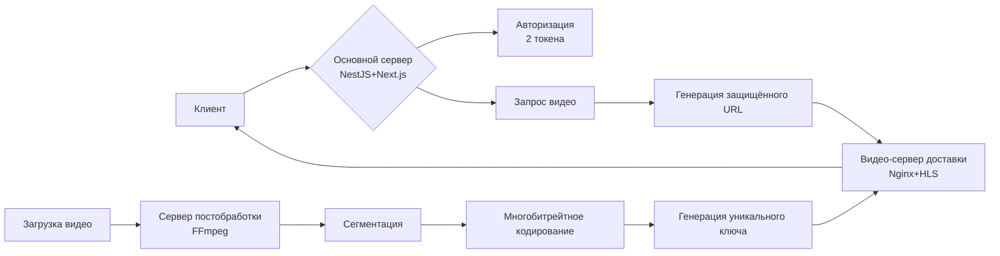

# 🎬 Linear Flow: Масштабируемая образовательная платформа с распределённой архитектурой

## 🎯 Обзор проекта

**Linear Flow** — это современная платформа для онлайн-обучения (LMS) с акцентом на интерактивное диалоговое обучение и высококачественную потоковую передачу видео. Платформа реализует **распределённую трёхсерверную архитектуру**, обеспечивающую безопасность, производительность и масштабируемость.

---

## 🏗️ Архитектурная концепция

### 📡 Распределение серверов

| Сервер | Назначение | Технологии | Основные функции |
|--------|------------|------------|------------------|
| **🎯 Основной сервер** | Бизнес-логика, API, фронтенд | NestJS, Next.js, PostgreSQL | Управление пользователями, курсами, авторизация, динамическая генерация URL |
| **🎥 Видео-сервер доставки** | Потоковая передача видео | Nginx + HLS, Lila (опционально) | Раздача зашифрованных HLS-потоков, обработка защищённых URL |
| **🔄 Сервер постобработки** | Обработка медиаконтента | FFmpeg, Node.js/Python | Кодирование видео, сегментация, генерация ключей шифрования |

---

## 🔐 Система безопасности

### Двухтокеновая авторизация

```javascript
// Пример токенов
{
  "access_token": "eyJ...",       // Короткоживущий (15-30 мин)
  "refresh_token": "fxz..."       // Долгоживущий (7-30 дней)
}
```

**Принцип работы:**
1. **Access Token** — для частых API-запросов, передаётся в заголовке `Authorization`
2. **Refresh Token** — для обновления access token, хранится в secure HTTP-only cookie
3. **Автоматическое обновление** — при истечении access token система прозрачно запрашивает новый

---

## 🎥 Система видео-доставки

### Защищённый HLS-поток с уникальными ключами

#### Процесс обработки видео:
1. **Загрузка** → Преподаватель загружает исходное видео на основной сервер
2. **Перенаправление** → Видео передаётся на сервер постобработки
3. **Обработка** → FFmpeg создаёт многобитрейтовые HLS-сегменты с уникальным ключом для каждого видео
4. **Передача** → Обработанные файлы отправляются на видео-сервер доставки
5. **Динамическая ссылка** → Основной сервер генерирует временный защищённый URL для клиента

#### Пример сгенерированного URL:
```
https://video.linearflow.app/secure/v1/stream/abc123-def456?token=eyJ0eXAiOiJKV1QiLCJhbG...
```

**Важно:** Прямые ссылки к видеофайлам никогда не раскрываются клиенту.

---

## 🔄 Динамическая подмена URL

### Схема работы:
1. Клиент запрашивает видеоурок через API основного сервера
2. Бэкенд генерирует **уникальный подписанный URL** с ограниченным временем жизни
3. Клиент получает временный URL вида: `/api/video/proxy/{encrypted-token}`
4. Nginx на видео-сервере проверяет подпись и токен перед отдачей контента

### Nginx конфигурация для проверки:
```nginx
location /secure/ {
    # Проверка валидности токена через внутренний запрос
    auth_request /validate-token;
    
    # Отдача HLS-сегментов
    types {
        application/vnd.apple.mpegurl m3u8;
        video/mp2t ts;
    }
    
    # Заголовки для CORS и кэширования
    add_header Access-Control-Allow-Origin *;
    add_header Cache-Control "public, max-age=7200";
}
```

---

## 🔑 Управление ключами шифрования

### Архитектура безопасности:
```
Каждое видео → Уникальный ключ шифрования → Хранится отдельно от сегментов
     ↓
Ключи хранятся на основном сервере в зашифрованном виде
     ↓
При запросе видео: проверка прав → генерация ключевого файла → динамическая подпись URL
```

### Преимущества:
- **Безопасность**: Компрометация одного ключа не затрагивает другие видео
- **Контроль доступа**: Возможность отзыва доступа к отдельным видео
- **Аудиторский след**: Логирование всех обращений к защищённому контенту

---

## 📊 Поток данных в системе



---

## 🛠 Технологический стек

### Основной сервер
- **Backend**: NestJS (TypeScript), Prisma ORM, PostgreSQL, JWT
- **Frontend**: Next.js (App Router), CSS Modules, Socket.io-client
- **Аутентификация**: Двухтокеновая система (access + refresh tokens)

### Видео инфраструктура
- **Обработка**: FFmpeg (HLS сегментация, кодирование в 240p/360p/480p/720p/1080p)
- **Доставка**: Nginx с HLS модулем, защищённая прокси-авторизация
- **Шифрование**: AES-128 для HLS сегментов, уникальные ключи на видео

### DevOps и инфраструктура
- **Серверы**: 3 независимых VDS (основной, видео-доставки, постобработки)
- **Сеть**: Защищённое взаимодействие между серверами (VPN/private network)
- **Мониторинг**: Логирование всех запросов к видео, метрики использования

---

## 🔒 Безопасность и контроль доступа

### Многоуровневая защита:
1. **Ролевая модель**: User → Student → Teacher
2. **Токены доступа**: JWT с различными scope для разных операций
3. **Проверка видео-доступа**: Каждый запрос валидируется против БД прав
4. **Временные URL**: Автоматическое истечение ссылок на видео
5. **HTTPS**: Обязательное шифрование всех соединений

### Аудит и логирование:
- Все запросы к видео-контенту логируются с user_id, video_id, timestamp
- Мониторинг попыток несанкционированного доступа
- Статистика использования видео-ресурсов

---

## 🚀 Преимущества архитектуры

| Преимущество | Описание |
|--------------|----------|
| **Масштабируемость** | Каждый сервер может масштабироваться независимо |
| **Безопасность** | Разделение контента и логики, уникальные ключи шифрования |
| **Производительность** | Видео-сервер оптимизирован только для раздачи статики |
| **Гибкость** | Возможность замены компонентов (например, FFmpeg на другой encoder) |
| **Отказоустойчивость** | Проблемы на одном сервере не затрагивают всю систему |

---

## 📈 Дорожная карта развития

1. **Фаза 1**: Развёртывание трёхсерверной архитектуры
2. **Фаза 2**: Внедрение динамической подмены URL и системы ключей
3. **Фаза 3**: Оптимизация видео-кодирования (адаптивный битрейт)
4. **Фаза 4**: Добавление аналитики просмотра видео (heatmaps, retention)
5. **Фаза 5**: Интеграция CDN для глобальной доставки контента

---

